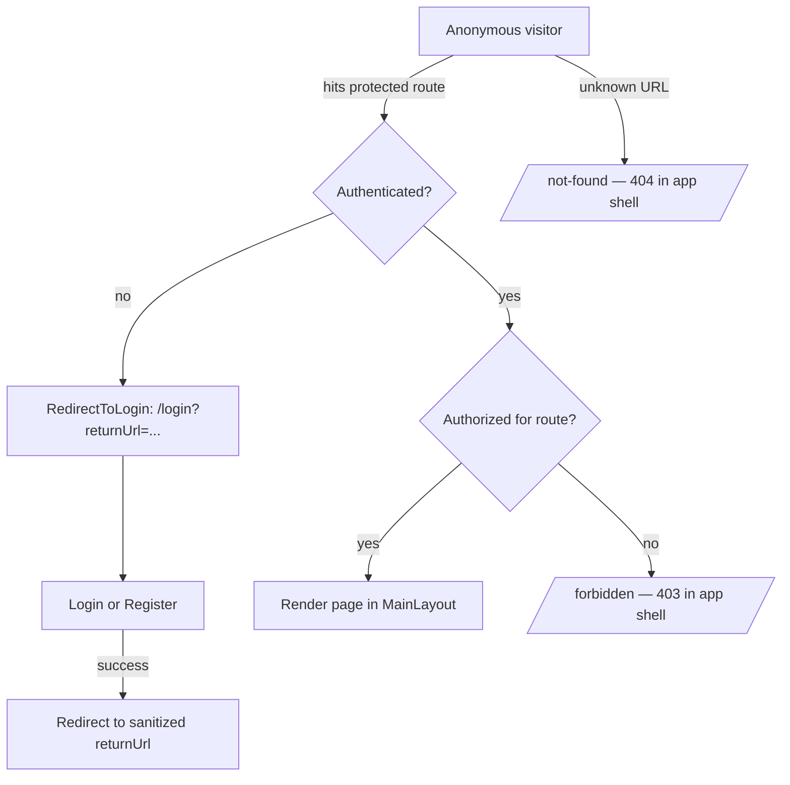
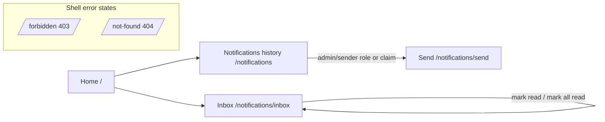

# MMCA.Common.UI — Navigation & Information Architecture

> The shared Blazor UI surface that `MMCA.Common.UI` ships to every consumer app (Login, Register,
> the notifications inbox/history, and the app-shell error pages). Consumer apps (MMCA.ADC,
> MMCA.Store) add their own module pages on top of this and document their per-actor flows in their
> own `NavigationFlow.md`; this file is the source of truth for the framework-provided routes and the
> role/claim model that gates them (rubric §25). It must match `Source/Presentation/MMCA.Common.UI`.

## Routes shipped by the framework

| Route | Page | Auth | Notes |
|-------|------|------|-------|
| `/` | `Home` | Anonymous | Landing; consumer apps usually override. |
| `/login` | `Auth/Login` | Anonymous | Accepts `?returnUrl=` (sanitized via `ReturnUrlProtector`). |
| `/register` | `Auth/Register` | Anonymous | Client + server validation parity (EditForm). |
| `/auth/oauth-complete` | `Auth/OAuthComplete` | Anonymous | External-login callback landing. |
| `/notifications` | `Notifications/NotificationList` | Authenticated | Push-notification history. Route carries `[Authorize]`. |
| `/notifications/inbox` | `Notifications/NotificationInbox` | Authenticated | Per-user durable inbox (paged). Route carries `[Authorize]`. |
| `/notifications/send` | `Notifications/NotificationSend` | Authenticated | Admin/sender surface. Route carries `[Authorize]`; the sender role/claim gate is consumer-declared (NavItem filter) and enforced server-side by the send API. |
| `/not-found` | `NotFound` | Any | 404 within the app shell (`Router.NotFoundPage`). |
| `/forbidden` | `Forbidden` | Any | 403 within the app shell (see below); rendered for authenticated-but-unauthorized hits via `AuthorizeRouteView`, but the route itself is open (a direct anonymous visit just shows the 403 page). |

## Guards & wayfinding (the §25 contract)

- **Route-level authorization, not UI hiding.** `Routes.razor` wraps routing in
  `AuthorizeRouteView`. Hiding a nav item is convenience only; the route itself is the boundary, and
  the API re-validates server-side (ADR-022/ADR-004) — UI hiding is never the security control.
- **404 and 403 are both handled in the app shell.** Unknown routes render `NotFound`
  (`Router.NotFoundPage`). An *unauthenticated* hit on a protected route redirects to `/login` with
  the original path captured as `returnUrl` (`RedirectToLogin` → `ReturnUrlProtector.Sanitize`, which
  blocks open-redirects). An *authenticated-but-unauthorized* hit renders the dedicated `Forbidden`
  (403) page in-shell — not a bare alert — so the user gets a real wayfinding affordance.
- **Role/claim-filtered navigation.** `NavItem(RequiredRole?, RequiredClaim?)` declares the gate;
  `NavMenu.razor` filters items by `_user.IsInRole(RequiredRole)` and
  `_user.HasClaim(c => c.Type == RequiredClaim)`, so a menu item never shows for a principal who
  cannot use the route (and the route stays guarded even if reached directly).
- **Focus management on navigation.** `FocusOnNavigate Selector="h1"` moves focus to the page
  heading on every route change (a11y, ties to §21). Error pages expose an `h1` heading.
- **State on navigation.** List pages preserve query/filter/page state via
  `ListPageQueryStateService` + `PersistentComponentState`; in-progress edits are protected by
  `UnsavedChangesGuard` (ties to §24).

## Anonymous → authenticated flow

## Authenticated wayfinding

## Role/claim model

- **Roles** gate coarse capability (`NavItem.RequiredRole`); the framework ships the named role
  policies, and consumers may layer the opt-in permission capability (ADR-020,
  `[HasPermission("x")]`) for finer grants.
- **Claims** gate per-actor surfaces that are not a role (`NavItem.RequiredClaim`) — e.g. a consumer
  app expressing "is a speaker" as a claim rather than a role.
- The same gate is evaluated in two places that must agree: `NavMenu` (visibility) and
  `AuthorizeRouteView` (enforcement). They read the same `RequiredRole`/`RequiredClaim`, so the menu
  and the route boundary cannot drift.
